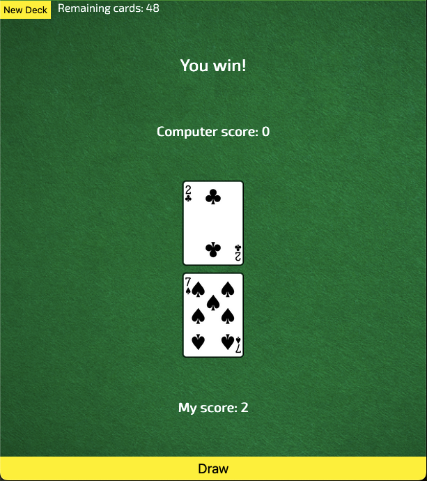

# War Card Game

This is a simple single-page application (SPA) built with HTML, CSS, and JavaScript that simulates the classic card game "War." The game utilizes a deck of 52 playing cards, and the player competes against the computer to determine who has the highest card in each round. Points are awarded accordingly, and the player with the most points at the end of the deck wins.

## Features

- New Deck Button: Generates a shuffled deck of 52 cards.
- Draw Button: Draws a card for both the player and the computer.
- Automatic Scoring: The higher card wins the round and earns a point.
- Ace is the highest: The ranking order follows: 2 < 3 < ... < King < Ace.
- **Winner Announcement:** After all cards have been drawn, the winner is displayed.

## Technologies Used

- HTML
- CSS
- JavaScript

## How to Play

1. Open the application in the browser: https://tavion-war-game.netlify.app/
2. Click the New Deck button to generate a shuffled deck.
3. Click Draw to reveal a card for yourself and the computer.
4. The game automatically compares the two cards and awards a point to the player with the higher card.
5. Repeat until all cards have been drawn.
6. At the end of the game, the player with the most points is declared the winner.

## Preview

